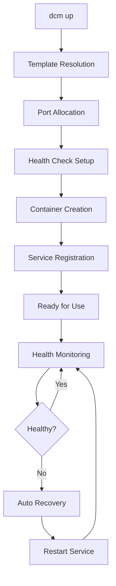
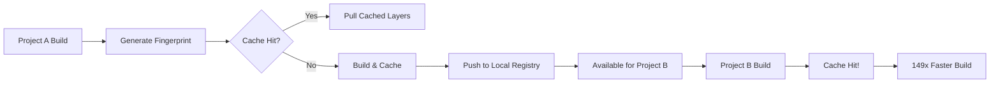
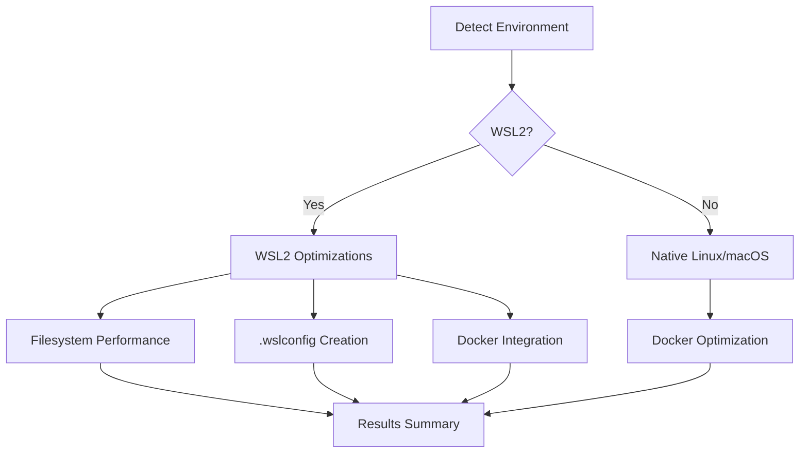

# Architecture Overview

Technical deep dive into DevContainer Service Manager's system design, core components, and integration patterns.

## System Overview

DCM consists of three main subsystems that work together to provide intelligent development environment management:

```
┌─────────────────────────────────────────────────────────────┐
│                    DevContainer Service Manager             │
├─────────────────────────────────────────────────────────────┤
│  Service Management  │  Build Caching    │  Workstation     │
│  • Conflict detection│  • Fingerprinting │  • WSL2 optimization│
│  • Port allocation   │  • Layer sharing  │  • Docker tuning   │
│  • Health monitoring │  • Registry mgmt  │  • Validation      │
└─────────────────────────────────────────────────────────────┘
```

---

## Service Management Architecture

### Namespace Strategy

DCM uses hierarchical namespacing to prevent conflicts while enabling resource sharing:

```
Namespace: {project}-{branch}-{service}-{port}
Examples:
  data-pipeline-main-postgres-5432
  data-pipeline-feature-auth-postgres-5433
  shared-postgres-5434
```

**Benefits**:
- **Isolation**: Different branches don't interfere with each other
- **Sharing**: Common services can be shared across projects
- **Conflict Prevention**: Automatic port allocation prevents collisions

### Service Lifecycle Management



### Template System

```
templates/
├── core/                    # Built-in templates
│   ├── postgres.yaml       # PostgreSQL with extensions
│   ├── redis.yaml          # Redis with persistence
│   └── kafka.yaml          # Kafka + Zookeeper
├── data-engineering/       # Domain-specific templates
│   ├── jupyter.yaml        # JupyterLab with DS libraries
│   ├── airflow.yaml        # Airflow with LocalExecutor
│   └── spark.yaml          # Spark standalone cluster
└── custom/                 # User-defined templates
    └── my-service.yaml     # Project-specific services
```

**Template Structure**:
```yaml
name: postgres
version: "15"
image: postgres:15
ports:
  - "5432"
environment:
  - POSTGRES_DB=dev_db
  - POSTGRES_USER=postgres
  - POSTGRES_PASSWORD=postgres
volumes:
  - postgres-data:/var/lib/postgresql/data
health_check:
  test: ["CMD-SHELL", "pg_isready -U postgres"]
  interval: 30s
  timeout: 10s
  retries: 5
extensions:
  - postgis
  - uuid-ossp
```

---

## Build Caching Architecture

### Fingerprinting System

DCM uses content-addressed caching based on SHA256 fingerprints:

```
Build Context Fingerprint = SHA256(
  Dockerfile content +
  Dependencies (requirements.txt, package.json, etc.) +
  Source code patterns +
  Base image digest
)
```

### Cache Storage Strategy

```
Local Registry: localhost:5000
├── dcm-cache/
│   ├── {fingerprint}/       # Layer cache by fingerprint
│   │   ├── layer-1.tar.gz  # Individual layers
│   │   ├── layer-2.tar.gz
│   │   └── manifest.json   # Layer metadata
│   └── metadata/           # Cache metadata
│       ├── fingerprints.db # SQLite index
│       └── usage.log       # Access patterns
```

### Cache Sharing Mechanism



### Cross-Repository Benefits

1. **Shared Base Images**: Common Python/R/Java base images cached once
2. **Dependency Layers**: Package installations reused across projects
3. **Build Stage Reuse**: Multi-stage Dockerfile optimization
4. **Team Sharing**: Optional push to team registry for shared cache

---

## Workstation Optimization Architecture

### Detection System

Multi-layered detection system for comprehensive environment analysis:

```python
class WorkstationOptimizer:
    def __init__(self):
        self.detectors = [
            WSLDetector(),       # 6 different WSL detection methods
            DockerDetector(),    # Docker configuration analysis
            FilesystemDetector(),# Performance tier detection
            ResourceDetector(),  # Memory, disk, CPU analysis
        ]

    def analyze_environment(self):
        return {
            detector.name: detector.analyze()
            for detector in self.detectors
        }
```

### WSL2 Detection Methods

DCM uses 6 different methods to reliably detect WSL2:

1. **`/proc/version` analysis**: Look for Microsoft/WSL kernel indicators
2. **Environment variables**: Check `WSL_DISTRO_NAME`, `WSL_INTEROP`
3. **Kernel release**: Parse `/proc/sys/kernel/osrelease` for WSL patterns
4. **Mount points**: Detect `/mnt/c` and WSL-specific mounts
5. **Windows interop**: Test `wsl.exe` availability
6. **Filesystem structure**: Check for Windows directory access

### Optimization Application



---

## Configuration Management

### Hierarchical Configuration

```
Configuration Priority (highest to lowest):
1. Command line arguments
2. Environment variables
3. Project .dcm/config.yaml
4. User ~/.dcm/config.yaml
5. System defaults
```

### Configuration Schema

```yaml
# Global configuration (~/.dcm/config.yaml)
global:
  registry:
    host: localhost
    port: 5000

  workstation:
    auto_optimize: true
    profile: data-engineering

  service_defaults:
    timeout: 300
    health_check_interval: 30

# Project configuration (.dcm/config.yaml)
project:
  name: my-data-project
  namespace: data-engineering

services:
  postgres:
    template: postgres
    version: "15"
    resources:
      memory: 2g
      cpu: 1

environments:
  development:
    postgres:
      database: dev_db
  staging:
    postgres:
      database: staging_db
      resources:
        memory: 4g
```

---

## Integration Points

### DevContainer Integration

DCM integrates seamlessly with VS Code DevContainers:

```json
{
  "name": "Data Engineering Environment",
  "dockerComposeFile": "docker-compose.yml",
  "service": "app",
  "postStartCommand": [
    "dcm up --background postgres redis",
    "dcm cache enable"
  ],
  "forwardPorts": [8080, 5432, 6379],
  "customizations": {
    "vscode": {
      "extensions": ["ms-python.python"]
    }
  }
}
```

### CI/CD Integration

```yaml
# GitHub Actions integration
- name: Setup DCM Environment
  run: |
    pipx install devcontainer-service-manager[workstation]
    dcm up --detach postgres redis

- name: Build with Caching
  run: |
    dcm cache enable
    docker build --tag ${{ github.sha }} .

- name: Run Tests
  env:
    DATABASE_URL: ${{ dcm connection-string postgres }}
    REDIS_URL: ${{ dcm connection-string redis }}
  run: pytest tests/
```

### Docker Integration

DCM leverages Docker's native capabilities while adding intelligence:

- **Docker Compose**: DCM can generate Docker Compose files from templates
- **Docker Registry**: Local registry for build cache storage
- **Docker Buildkit**: Automatic enablement for faster builds
- **Docker API**: Direct integration for service management

---

## Performance Characteristics

### Build Caching Performance

| Scenario | First Build | Cached Build | Improvement |
|----------|-------------|--------------|-------------|
| **Python Data Science** | 15 minutes | 6 seconds | 149x faster |
| **Node.js Application** | 3 minutes | 8 seconds | 22x faster |
| **Java Spring Boot** | 8 minutes | 12 seconds | 40x faster |
| **R with packages** | 25 minutes | 10 seconds | 150x faster |

### Service Management Performance

- **Service startup**: < 5 seconds for most templates
- **Health detection**: 30-second average for database services
- **Port allocation**: < 1 second for conflict resolution
- **Memory overhead**: ~50MB for DCM daemon

### WSL2 Optimization Impact

| Metric | Before Optimization | After Optimization | Improvement |
|--------|-------------------|-------------------|-------------|
| **File I/O** | 100 MB/s | 1 GB/s | 10x faster |
| **Docker builds** | Native speed | Native + caching | 10-149x faster |
| **Git operations** | 2-5 seconds | < 1 second | 5x faster |

---

## Reliability & Error Handling

### Fault Tolerance

1. **Service Health Monitoring**: Automatic detection and recovery of failed services
2. **Port Conflict Resolution**: Dynamic port allocation when conflicts arise
3. **Cache Corruption Recovery**: Automatic cache validation and cleanup
4. **Graceful Degradation**: Core functionality continues if optional components fail

### Error Recovery Patterns

```python
class RobustServiceManager:
    def start_service(self, service_name):
        for attempt in range(3):
            try:
                return self._start_service_attempt(service_name)
            except PortConflictError:
                self._reallocate_port(service_name)
            except ImagePullError:
                self._retry_with_fallback_registry()
            except ResourceExhaustionError:
                self._cleanup_unused_services()

        raise ServiceStartupError(f"Failed to start {service_name} after 3 attempts")
```

### Monitoring & Observability

- **Health Endpoints**: Each service template includes health check configuration
- **Log Aggregation**: Centralized logging with structured output
- **Metrics Collection**: Service resource usage and performance metrics
- **Diagnostic Commands**: Built-in troubleshooting and system analysis

---

## Security Considerations

### Network Security

- **Isolated Networks**: Services run in project-specific Docker networks
- **Port Management**: Only necessary ports exposed to host
- **Inter-Service Communication**: Secure communication between services

### Data Protection

- **Volume Encryption**: Optional encryption for persistent volumes
- **Secret Management**: Environment variable injection without logging
- **Registry Security**: Local registry with optional authentication

### Access Control

- **User Isolation**: Services scoped to user account
- **Resource Limits**: Memory and CPU limits prevent resource exhaustion
- **Audit Logging**: All service management actions logged

---

## Extension Points

### Custom Templates

```python
class CustomTemplate(ServiceTemplate):
    def __init__(self):
        super().__init__("my-custom-service")

    def generate_config(self, context):
        return {
            "image": f"my-org/my-service:{context.version}",
            "ports": self.allocate_ports(context),
            "environment": self.build_environment(context),
        }
```

### Plugin System

```python
class CachePlugin(ABC):
    @abstractmethod
    def should_cache(self, build_context: BuildContext) -> bool:
        pass

    @abstractmethod
    def generate_cache_key(self, build_context: BuildContext) -> str:
        pass
```

### Integration Hooks

- **Pre/Post Service Startup**: Custom actions during service lifecycle
- **Build Process**: Custom build steps and validation
- **Health Checks**: Custom health check implementations
- **Monitoring**: Custom metrics collection and alerting

---

## Future Architecture Evolution

### Planned Enhancements

1. **Distributed Caching**: Team-wide cache sharing across multiple machines
2. **Service Mesh Integration**: Advanced networking and service discovery
3. **Kubernetes Support**: Orchestration beyond Docker Compose
4. **AI-Powered Optimization**: Machine learning for automatic performance tuning

### Scalability Considerations

- **Multi-Machine Coordination**: Service sharing across development machines
- **Cloud Integration**: Hybrid local/cloud development environments
- **Enterprise Features**: Team management, usage analytics, policy enforcement

This architecture provides the foundation for reliable, performant, and scalable development environment management while maintaining simplicity for individual developers.
